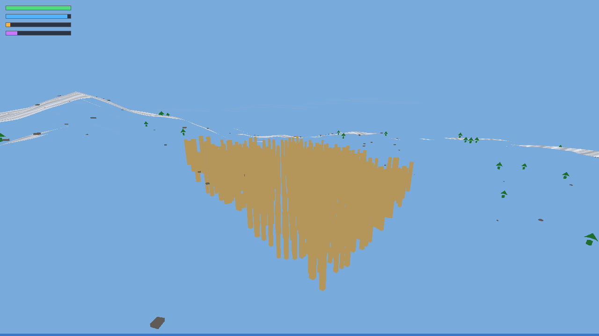
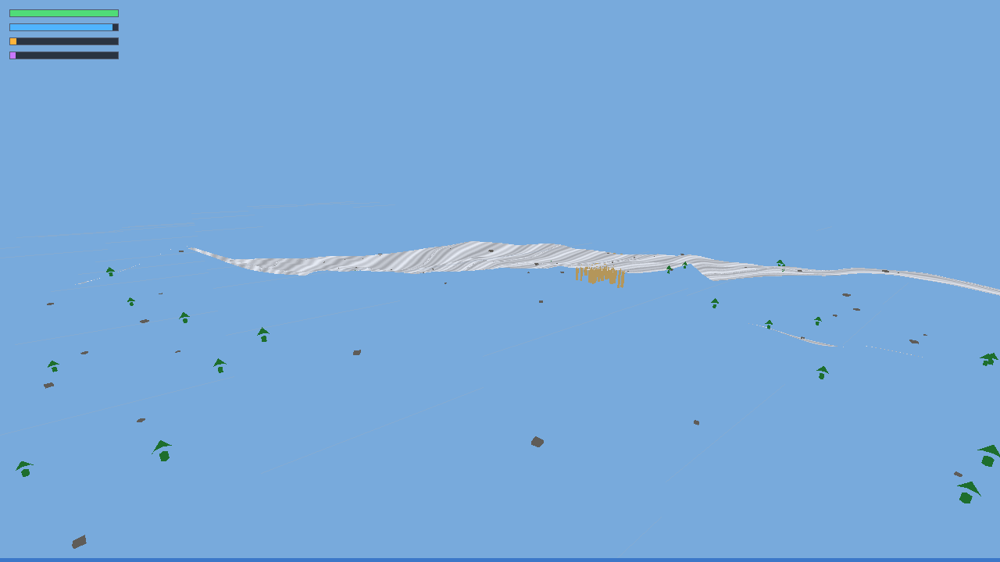
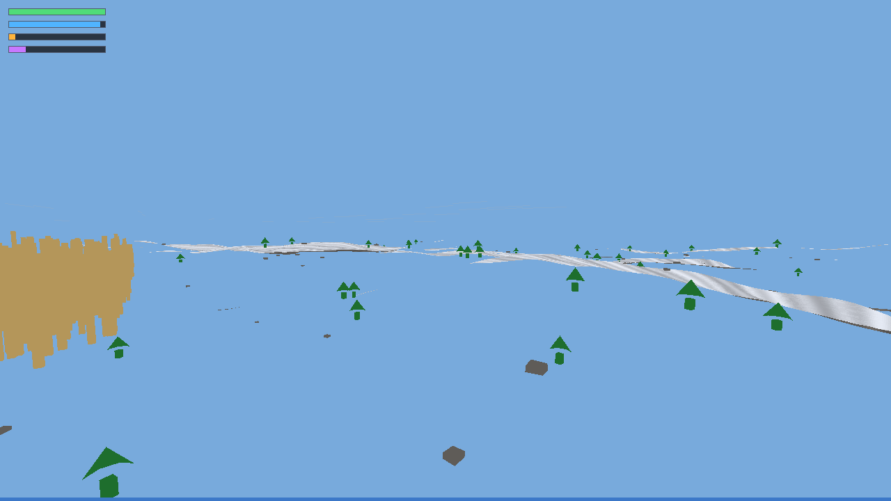
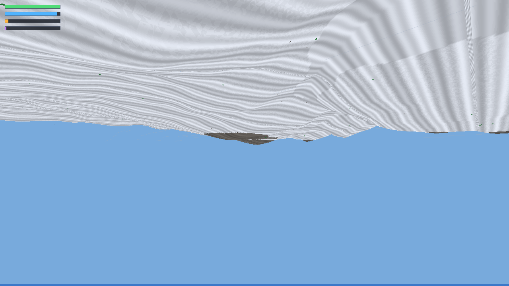

# Procedural continent (`proc_world.py`)

High-detail procedural **game-shaped** CPU stress workload: flyable fBm terrain, chunked retained meshes, textured height bands, instanced trees/rocks/cube city, Python frustum culling, and a font-free HUD. This complements the microbenches (`cpu_tri_bench`, `cpu_mesh_bench`, …) with an integrated scene that mixes **fill**, **transform/clip/bin**, and **2D HUD** cost.

## Run

```bash
# Install (from repo root)
python3 -m venv .venv && .venv/bin/pip install . numpy

# Interactive flyover (1280×720, WASD + mouse-look)
.venv/bin/python python/examples/proc_world.py --preset play

# CI / headless smoke (~3 s, tiny world)
HYPERLITE_HEADLESS=1 .venv/bin/python python/examples/proc_world.py --preset smoke --headless --seconds 3

# Stress bench (headless autopilot, 8 s)
HYPERLITE_HEADLESS=1 .venv/bin/python python/examples/proc_world.py --preset limit --headless --seconds 8
```

### CLI

| Flag | Purpose |
|------|---------|
| `--preset {smoke,play,limit}` | World size, density, default resolution |
| `--seed N` | Deterministic noise + prop scatter (default `42`) |
| `--headless` | `present="headless"` (no window) |
| `--auto` | Autopilot camera (on by default when headless) |
| `--seconds N` | Auto-exit after N seconds |
| `--width / --height` | Override framebuffer size |
| `--vsync` | Enable vsync (default **off** for uncapped bench) |
| `--dump-png DIR` | Headless: render posed stills (`city`, `terrain`, `forest`, `water`) to DIR and exit |

Controls when windowed: **WASD** move, **Space/Ctrl** up/down, **Enter** or **click** to capture mouse, **Esc** release/quit.

## Stills

Real CPU framebuffer dumps from `--preset play --headless --seed 42` (1280×720, depth on, vsync off):

  
Cube city — elevated 3/4 view over blocks and surrounding terrain.

  
Mountains — height bands and valley water.

  
Forest — instanced trees and rocks away from the city.

  
Low flight over water toward the cube city.

Capture locally:

```bash
HYPERLITE_HEADLESS=1 .venv/bin/python python/examples/proc_world.py --preset play --headless --seed 42 --dump-png docs/proc-world-stills
```

## What it stresses

| Subsystem | How |
|-----------|-----|
| **Fill / textured raster** | Each visible terrain chunk is a **unique** indexed heightgrid (`load_mesh` + `draw_mesh_textured`). Limit preset submits **~280k–580k tris/frame** depending on view. |
| **Transform / clip / bin** | Trees, rocks, and cube-city blocks share three prop meshes; limit submits **~3.3k–4.1k instances/frame** via **`draw_mesh_many`** (three batches: tree / rock / city). Terrain chunks stay per-chunk `draw_mesh_textured`. |
| **Translucent path** | Sea-level water uses `draw_mesh` with `a<255` (depth test, no depth write). |
| **2D HUD** | Rect bars only (fps, chunks, tris, props) — small but non-zero 2D work atop 3D. |
| **Generation (startup)** | Python + NumPy builds **784** unique chunk meshes for limit (~11.5 s on the VM below). Bounded world — no streaming/`unload_mesh`. |

Python performs **frustum + distance cull** before submitting draws; the full continent is never sent every frame.

## Presets

| Preset | Resolution | World | Draw radius | City | Typical use |
|--------|------------|-------|-------------|------|-------------|
| `smoke` | 320×180 | 4×4 chunks, 17×17 verts | 2 chunks | none | CI smoke, ~3 s |
| `play` | 1280×720 | 24×24 chunks, 33×33 verts | 8 chunks | 22×22 cubes | Interactive flyover |
| `limit` | 1280×720 | 28×28 chunks, 41×41 verts | 13 chunks | 46×46 cubes | Headless stress |

Chunk size is **32 m**. Limit keeps startup under ~12 s generation on the cloud VM by bounding chunk count instead of shrinking per-frame submit.

## Measured numbers (this cloud VM)

Captured on the Cursor Cloud Agent VM ([cloud-agent-vm-specs.md](cloud-agent-vm-specs.md)):

| Item | Value |
|------|-------|
| CPU | Intel Xeon (KVM), **4 cores** |
| RAM | ~16 GiB |
| GPU | none (CPU backend only) |
| OS | Ubuntu 24.04 |
| Build | Release, `-march=native`, OpenMP 4.5 |
| Present | headless, vsync off |

Commands:

```bash
export HYPERLITE_HEADLESS=1
.venv/bin/python python/examples/proc_world.py --preset smoke --headless --seconds 3
.venv/bin/python python/examples/proc_world.py --preset limit --headless --seconds 8
```

### `smoke` (3 s headless)

```
proc_world generated preset=smoke seed=42 chunks=16 props=8 terrain_tris=8194 gen_s=0.05
preset=smoke frames=18321 fps=6106.8 ms=0.16 chunks_drawn=3 tris_submitted=1659 props_drawn=5
```

Tiny world; meant to validate wiring, not measure throughput.

### `limit` (8 s headless, seed=42)

```
proc_world generated preset=limit seed=42 chunks=784 props=5164 terrain_tris=2508802 gen_s=11.48
preset=limit frames=362 fps=45.2 ms=22.10 chunks_drawn=115 tris_submitted=415877 props_drawn=3594
```

Per-second samples during the run ranged **~18–85 fps** as the autopilot camera swung between dense city + forest views (~165 chunks, ~578k tris) and open horizon (~74 chunks, ~285k tris).

**Bottleneck read:** at limit, cost is **both fill and transform/clip/bin**. Textured terrain supplies hundreds of thousands of unique triangles per frame (fill + perspective UV). Prop draws use **`draw_mesh_many`** (see [mesh-instances.md](mesh-instances.md)) so transform/clip runs per instance but **tile bin + fill + Python dispatch** happen once per prop mesh type (~3 native calls/frame instead of ~3.6k). Spikes to ~580k tris/frame correlate with **~18 fps**; lighter views recover toward **~85 fps**.

Compare with flat microbenches in [3d-mesh-bench.md](3d-mesh-bench.md) (~5–8 M tris/s on repeated topology). Here, **unique chunk topology + mixed textured fill + thousands of model matrices** is deliberately worse than a single repeated grid.

### `limit` with mesh instancing (8 s headless, seed=42)

Props use **`draw_mesh_many`** (three batches: tree / rock / city). Terrain stays per-chunk `draw_mesh_textured`.

| | fps | ms | chunks | tris | props |
|---|-----|-----|--------|------|-------|
| Per-prop `draw_mesh` (main + Hi-Z) | 45.1 | 22.18 | 115 | 415824 | 3588 |
| Batched props (`draw_mesh_many`) | 65.2 | 15.35 | 118 | 427635 | 3612 |

Dense city views: **~18.5 fps → ~37 fps** at ~578k tris/frame. See [mesh-instances.md](mesh-instances.md).

## See also

- [mesh-instances.md](mesh-instances.md) — batched `draw_mesh_many` API and proc_world before/after
- [3d-meshes.md](3d-meshes.md) — mesh/atlas API
- [3d-mesh-bench.md](3d-mesh-bench.md) — retained-mesh microbenches
- [3d-plan.md](3d-plan.md) — layer roadmap
